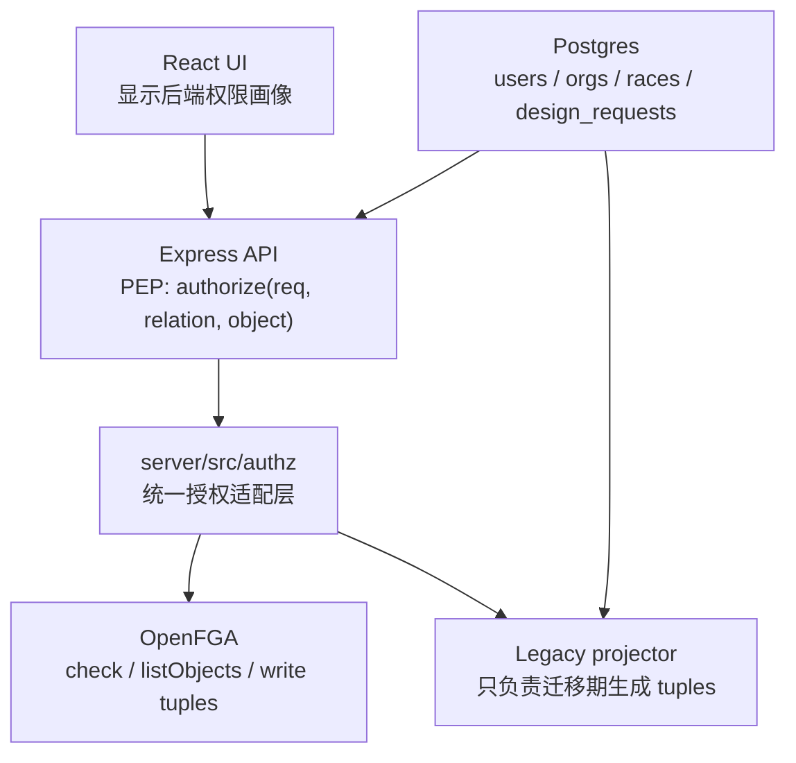

# ArcSpro OpenFGA 权限架构开发文档

## 目标

把 ArcSpro 的权限判断从“角色 + 前端模块矩阵 + 零散路由判断”迁到统一授权层。

现状里，同一个问题在三个地方重复回答：

- 前端用 `surfaceAccess` 决定能不能进 `/app`、`/ops`、`/admin`。
- 前端和后端分别用 `moduleAccess` 决定能不能打开 `app:design-requests` 这类模块。
- 后端 `requirePermission()` 用角色、surface、module 参数做最后判断。

这套模型扩到更多应用权限后会继续变乱。目标不是再补一个判断，而是把“谁能对哪个对象做什么”变成一套稳定查询：

```js
await authorize(req, {
  relation: 'can_open',
  object: 'module:org_123/app/design-requests',
})
```

业务代码只问授权问题，不再读角色细节。

## 官方依据

本方案按 OpenFGA 官方文档推进：

- OpenFGA 的基本单位是 `user`、`relation`、`object` 组成的 relationship tuple，授权检查由模型和 tuple 共同决定：https://openfga.dev/docs/concepts
- Node.js 使用官方 `@openfga/sdk`，官方安装命令是 `npm install @openfga/sdk`：https://openfga.dev/docs/getting-started/install-sdk
- SDK 客户端需要 `FGA_API_URL`、`FGA_STORE_ID`，可带 `FGA_MODEL_ID`：https://openfga.dev/docs/getting-started/setup-sdk-client
- 授权模型写入 store 后得到不可变的 model id，业务请求可以指定该 model id：https://openfga.dev/docs/getting-started/configure-model
- 授权数据通过 tuple 写入和删除，例如 `user:anne reader document:Z`：https://openfga.dev/docs/getting-started/update-tuples
- `check` 用来回答单次授权问题，`listObjects` 用来列出用户可访问对象：https://openfga.dev/docs/getting-started/perform-check 和 https://openfga.dev/docs/getting-started/perform-list-objects
- 多组织上下文需要把“当前组织”纳入授权请求，不能只看用户全局身份：https://openfga.dev/docs/modeling/organization-context-authorization
- 组织、赛事、模块之间要用对象到对象关系，而不是复制每个用户的全部模块权限：https://openfga.dev/docs/interacting/managing-relationships-between-objects

## 设计原则

### 先分清授权级别，再分配模块

系统里有四个层级，不能互相冒充：

| 层级 | OpenFGA 对象 | 典型账号 | 默认入口 | 说明 |
| --- | --- | --- | --- | --- |
| 平台层 | `platform:root` | `super_admin` | `/admin` | 系统治理、机构治理、全局身份、全局财务和审计。平台层不需要先选机构或赛事。 |
| 机构层 | `organization:<orgId>` | `org_admin` | `/admin` 或 `/app` | 管理本机构资料、成员、授权、赛事配置和机构级应用。 |
| 赛事层 | `race:<raceId>` | `race_admin`、执行人员 | `/ops` 或 `/app` | 现场执行、扫码、领取、仓储、证件等赛事级动作。 |
| 模块层 | `module:<scope>/<surface>/<moduleId>` | 所有账号 | 随所属入口 | 控制具体应用是否可见、可打开。 |

`super_admin` 的授权来源是 `platform:root#admin`，不是某个组织或赛事。组织和赛事只是在他进入具体业务视图后作为数据过滤上下文。登录后如果没有显式选择工作区，后端必须返回：

```json
{
  "scopeType": "platform",
  "orgId": null,
  "raceId": null,
  "surfaces": ["app", "ops", "admin"],
  "modules": ["app:home", "ops:scan", "admin:dashboard", "admin:orgs", "admin:identity-center"]
}
```

这条规则解决“系统管理员必须选择赛事才能管理系统”的根因。

### 不再把角色当权限答案

角色只负责初始化关系和管理后台展示。运行时不问“这个人是不是 `org_admin`”，只问：

```text
user:u1 是否 can_enter surface:org_1/admin
user:u1 是否 can_open module:org_1/admin/identity-center
user:u1 是否 can_review design_request:req_1
```

`super_admin` 只写入平台治理关系，不再自动代表所有业务动作。

### 工作区是授权上下文

所有 surface 和 module 对象都带组织或赛事 ID：

```text
surface:org_1/app
surface:org_1/admin
surface:race_2026_cd/ops

module:org_1/app/design-requests
module:org_1/admin/identity-center
module:race_2026_cd/ops/bib-pickup
```

这样 `app:design-requests` 不再是全局开关。同一个用户可以在组织 A 有设计工作台，在组织 B 没有。

### 前端只消费权限画像

前端不再自己推导 `org_admin` 是否全模块，也不再保留 `strictSurfaceModules`。登录和刷新资料后拿到后端给出的画像：

```json
{
  "surfaces": ["app", "admin"],
  "modules": ["app:home", "app:profile", "app:design-requests", "admin:identity-center"],
  "workspaces": [
    {
      "orgId": "org_1",
      "orgName": "中奥资源",
      "scopes": [
        { "scopeType": "org", "id": "__org__", "name": "组织运营" },
        { "scopeType": "race", "id": "1001", "name": "2026 成都定向赛" }
      ]
    }
  ]
}
```

导航只按这个画像渲染。直接访问路由仍由后端和 route guard 二次检查。

## 目标结构



PEP 是 policy enforcement point。Express middleware 是唯一执行点。业务模块不直接访问 OpenFGA SDK。

## OpenFGA 授权模型

第一版模型覆盖四层：组织、赛事、入口、模块、设计需求。

```fga
model
  schema 1.1

type user

type platform
  relations
    define admin: [user]
    define can_manage: admin

type organization
  relations
    define parent_platform: [platform]
    define member: [user]
    define admin: [user]
    define platform_admin: [user] or admin from parent_platform
    define can_view: member or admin or platform_admin
    define can_manage: admin or platform_admin

type race
  relations
    define parent: [organization]
    define viewer: [user, organization#member]
    define operator: [user]
    define manager: [user, organization#admin, organization#platform_admin]
    define can_view: viewer or operator or manager
    define can_operate: operator or manager
    define can_manage: manager

type surface
  relations
    define parent_org: [organization]
    define parent_race: [race]
    define granted: [user, organization#member, organization#admin, organization#platform_admin, race#operator, race#manager]
    define can_enter: granted

type module
  relations
    define parent_surface: [surface]
    define granted: [user, organization#member, organization#admin, organization#platform_admin, race#operator, race#manager]
    define can_open: granted and can_enter from parent_surface

type design_request
  relations
    define parent_org: [organization]
    define parent_race: [race]
    define requester: [user]
    define designer: [user]
    define reviewer: [user, organization#admin]
    define can_view: requester or designer or reviewer
    define can_create: requester
    define can_work: designer
    define can_review: reviewer
```

如果 OpenFGA 模型校验拒绝某个 relation 组合，执行时以官方 CLI/SDK 校验结果为准，调整 DSL，不调整业务语义。

## Tuple 规则

### 用户和组织

```json
[
  { "user": "user:u_super", "relation": "admin", "object": "platform:root" },
  { "user": "platform:root", "relation": "parent_platform", "object": "organization:org_1" },
  { "user": "user:u_org_admin", "relation": "admin", "object": "organization:org_1" },
  { "user": "user:u_designer", "relation": "member", "object": "organization:org_1" }
]
```

### 赛事授权

```json
[
  { "user": "organization:org_1", "relation": "parent", "object": "race:1001" },
  { "user": "user:u_race_admin", "relation": "manager", "object": "race:1001" },
  { "user": "user:u_operator", "relation": "operator", "object": "race:1001" }
]
```

### 入口授权

```json
[
  { "user": "organization:org_1#member", "relation": "granted", "object": "surface:org_1/app" },
  { "user": "organization:org_1#admin", "relation": "granted", "object": "surface:org_1/admin" },
  { "user": "race:1001#operator", "relation": "granted", "object": "surface:race_1001/ops" }
]
```

### 模块授权

```json
[
  { "user": "surface:org_1/app", "relation": "parent_surface", "object": "module:org_1/app/design-requests" },
  { "user": "user:u_designer", "relation": "granted", "object": "module:org_1/app/design-requests" },
  { "user": "surface:org_1/admin", "relation": "parent_surface", "object": "module:org_1/admin/identity-center" },
  { "user": "organization:org_1#admin", "relation": "granted", "object": "module:org_1/admin/identity-center" }
]
```

### 设计需求对象

```json
[
  { "user": "organization:org_1", "relation": "parent_org", "object": "design_request:req_1" },
  { "user": "user:u_requester", "relation": "requester", "object": "design_request:req_1" },
  { "user": "user:u_designer", "relation": "designer", "object": "design_request:req_1" },
  { "user": "organization:org_1#admin", "relation": "reviewer", "object": "design_request:req_1" }
]
```

## 后端接口

### 内部授权 API

文件位置：

```text
server/src/authz/
  authz.service.js
  object-ids.js
  openfga.client.js
  local-checker.js
  profile.service.js
  tuple-projector.js
  model/arcspro.fga
```

核心调用：

```js
await authz.assert(req.authContext, {
  relation: 'can_open',
  object: moduleObjectId({
    orgId: req.authContext.orgId,
    surface: 'admin',
    moduleId: 'identity-center',
  }),
})
```

Express middleware：

```js
app.use(
  '/api/admin/identity-center',
  requireAuthz({
    surface: 'admin',
    moduleId: 'identity-center',
    relation: 'can_open',
  }),
  identityCenterRoutes,
)
```

### 前端可见画像

新增：

```http
GET /api/authz/profile?orgId=org_1&raceId=1001
```

响应：

```json
{
  "success": true,
  "data": {
    "scopeType": "race",
    "orgId": "org_1",
    "raceId": "1001",
    "surfaces": ["app", "ops", "admin"],
    "modules": ["app:home", "app:profile", "ops:scan", "admin:identity-center"],
    "workspaceScopes": [
      { "scopeType": "org", "orgId": "org_1", "raceId": null },
      { "scopeType": "race", "orgId": "org_1", "raceId": "1001" }
    ]
  }
}
```

超级管理员不带组织和赛事上下文时返回平台画像：

```http
GET /api/authz/profile
```

```json
{
  "success": true,
  "data": {
    "scopeType": "platform",
    "orgId": null,
    "raceId": null,
    "surfaces": ["app", "ops", "admin"],
    "modules": ["app:home", "ops:scan", "admin:dashboard", "admin:orgs", "admin:identity-center"],
    "workspaceScopes": [
      {
        "scopeType": "platform",
        "orgId": null,
        "orgName": "系统平台",
        "raceId": null,
        "raceName": null
      }
    ]
  }
}
```

错误：

```json
{
  "success": false,
  "message": "无权访问该工作区"
}
```

## 迁移顺序

### Phase 1: 落模型和适配层

- 安装 `@openfga/sdk`。
- 新增 `server/src/authz/model/arcspro.fga`。
- 新增 OpenFGA client，读取 `FGA_API_URL`、`FGA_STORE_ID`、`FGA_MODEL_ID`。
- 新增本地 checker，只用于测试和没有 OpenFGA 服务的本地开发；生产环境缺少 OpenFGA 配置直接启动失败。
- 为 `check`、`listObjects`、`writeTuples` 写单元测试。

### Phase 2: 从旧数据投影 tuples

- `super_admin` 投影到 `platform:root#admin`，再由 `organization#parent_platform` 派生 `organization#platform_admin`。
- `org_admin` 和普通成员投影到 `organization#admin/member`。
- `user_race_permissions` 和 `org_race_permissions` 投影到 `race#viewer/operator/manager`。
- `user_module_access` 投影到 `module#granted`。
- role 默认模块不再在运行时 bypass，而是在投影时写成明确 tuple。

### Phase 3: 权限画像

- 新增 `GET /api/authz/profile`。
- 登录成功、`/api/profile/me`、工作区切换都使用同一份画像。
- 前端 `hasModuleAccess` 只读画像，不再判断 `org_admin`、`super_admin`。

### Phase 4: 路由授权

- 新增 `requireAuthz()` 替代 `requirePermission()`。
- `/api/admin/*` 每个挂载点必须带 module id。
- `needsRace` 页面增加后端和前端 route guard：没有 race context 时不能进入赛事级模块。
- 兼容期保留 `requirePermission()`，但内部 shadow 调 `authz.check()` 并记录差异。

### Phase 5: Identity Center 改写

- 模块矩阵改为写 OpenFGA tuples。
- UI 不再显示“角色默认但可勾掉”的假象。继承权限、直接授权、临时授权分三列显示。
- 保存后重新拉 `/api/authz/profile`，确认导航立即收敛。

## 验收用例

### 单元测试

```bash
node --test server/tests/authz/*.test.js
npm run test:surfaces
npm run build
```

### API 验收

```bash
curl -H "Authorization: Bearer <token>" \
  "http://127.0.0.1:3000/api/authz/profile?orgId=org_1&raceId=1001"
```

期望：

- 设计师账号只返回 `app:design-requests`，不返回 `admin:design-requests`。
- 证件发放员返回 `ops:credentials`，不返回 `admin:credential-center`。
- 组织管理员没有显式执行模块时不返回 `ops:scan`。

### 浏览器验收

真实账号登录后检查：

- 普通用户：能进 `/app`，不能进 `/admin` 和 `/ops`。
- 设计师：能看到“设计工作台”，直接访问 `/admin/design-requests` 被拒绝。
- 执行人员：能进执行层扫码或发放入口，不能看到后台规则配置。
- 组织管理员：能进身份中心和组织管理；没有执行授权时执行层入口不可见。
- 超级管理员：登录后默认进入平台治理，不需要先选机构或赛事；入口权限包含应用端、执行端、管理端。切到应用端或执行端时先选择机构或赛事作为数据上下文，不改变平台授权来源。

## 风险处理

- OpenFGA 服务不可用：生产直接失败；开发环境允许本地 checker，控制台显示 `AUTHZ_PROVIDER=local`。
- tuple 投影滞后：所有 Identity Center 写操作同时写业务表和 OpenFGA；失败时事务回滚。
- 模型演进：每次模型变化生成新 `FGA_MODEL_ID`，旧 model id 不覆盖。上线前跑断言测试。
- 性能：权限画像使用 `listObjects` 批量取 surface/module；业务写接口使用 `check`。高频页面可以短 TTL 缓存用户画像，写授权后清缓存。

## 本次实现边界

本轮不重写所有业务页面。第一轮只完成底层和权限入口：

- OpenFGA SDK、模型文件、authz 适配层。
- 旧数据到 tuple 的投影服务。
- `GET /api/authz/profile`。
- `requireAuthz()` 和首批 admin/app/ops 挂载点替换。
- 前端改为后端画像驱动导航。
- 本地 dev + 真实账号浏览器验证。

旧 `user_module_access` 表暂时保留，作为迁移期事实来源。等 Identity Center 完全改写后再删表。
